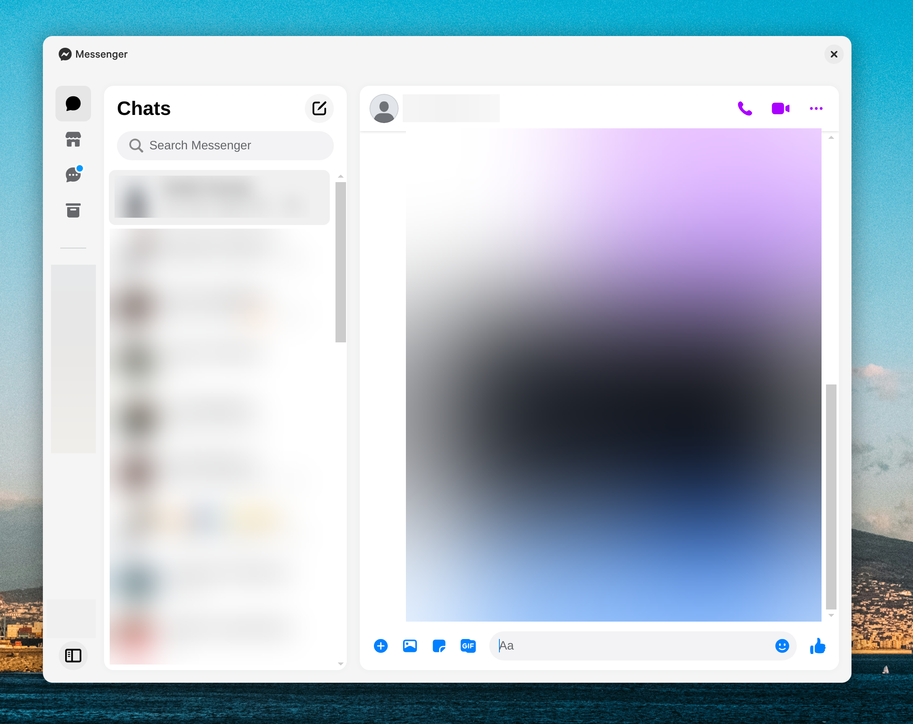

# Facebook Messenger for Gnome

This project aims to provide a more native-looking experience of using Facebook Messenger on Gnome through Electron. The project mainly supports Wayland.

## Settings

While the app aims to provide native-looking experience, the app itself is still an Electron app with its shortcomings:

Electron apps doesn't support rounded corners and shadows when using client side decorations.
Therefore, this app implements both rounded corners and shadows in HTML/CSS as a workaround.
As the workaround for shadows can result in unexpected behaviour, the app allows you to quickly disable/enable it by pressing "Ctrl+K".
The preferences will be saved automatically.

### Out of the box experience
The app uses workarounds out of the box. If it works, you can leave the workarounds enabled.

### Recommended experience

To get a more native-like experience, I would recommend to disable the workaround by pressing "Ctrl+K" once, and install this Gnome extension instead: [Rounded Window Corners Reborn](https://github.com/flexagoon/rounded-window-corners).

## Screenshots

## Test the app

### With Flatpak
Download and install the latest GitHub release for your architecture.

### With Node.js
 1. Clone the project
 2. Run `npm install`
 3. Run `npm start --enable-features=UseOzonePlatform --ozone-platform=wayland`
